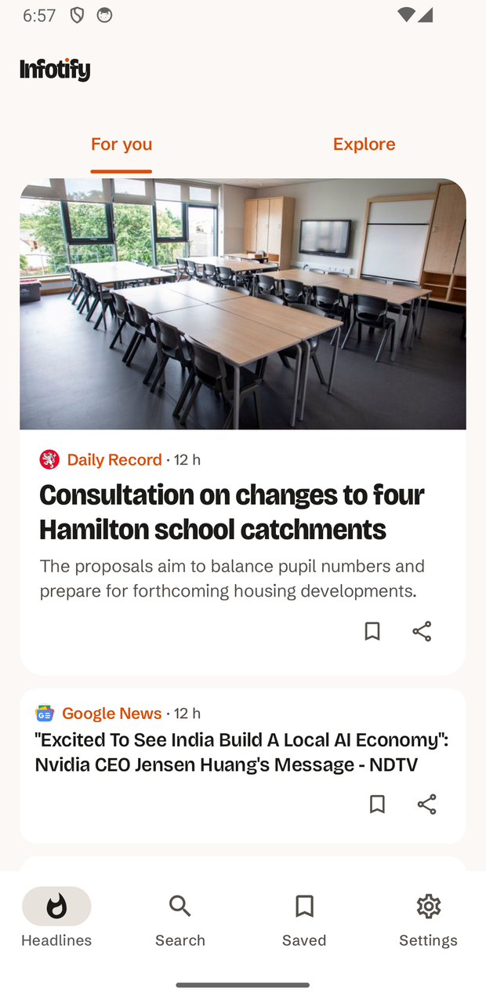
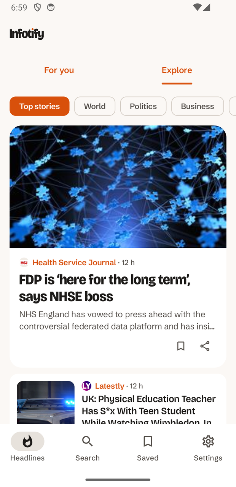

# Infotify

[](https://www.android.com)
[](https://android-arsenal.com/api?level=26)
[](https://opensource.org/licenses/MIT)

A news reader that answers *"what matters to me today"* rather than *"what is available"*.
Pick up to five subjects and a region, and the feed leads with them.

Kotlin and Jetpack Compose throughout. Designed and published by **Nativia Solutions**.

<a href="https://play.google.com/store/apps/details?id=com.thecode.infotify">
    
</a>

---

## What it does

- **For you** — a personalised feed built from your subjects and region.
- **Explore** — all 15 subjects, always one tap away. Discovery is half the home screen,
  not an option buried in settings; that is the structural answer to filter bubbles.
- **Search** across thousands of publishers, debounced as you type.
- **Save** articles and read them offline.
- **Read offline** — the last feed is kept on device and served when the network fails,
  with a banner saying how old it is.
- **One daily briefing**, at an hour you choose, and *only* when something new has been
  published in your subjects. Nothing new means no notification.
- **Follow the system theme**, or force light or dark.
- 9 languages of news coverage: English, Français, Español, Deutsch, Italiano, Português,
  Nederlands, Русский, العربية.

Articles open at the publisher in a Custom Tab. No news provider licenses full-text
redistribution, and reading belongs with the outlet that did the work.

## Screenshots

<table>
  <tr><th>For you</th><th>Explore</th></tr>
  <tr>
    <td></td>
    <td></td>
  </tr>
</table>

## Architecture

Clean Architecture with MVI on the screens that have a real state machine. Full notes in
[docs/ARCHITECTURE.md](docs/ARCHITECTURE.md).

```
ui (Compose) ──▶ presentation (UiState / Intent / Effect)
                      │
                      ▼
                 domain (use cases, models, repository interfaces)
                      ▲
                      │ implements
                 data (repositories, Retrofit, Room, DataStore)
```

The domain references neither Android, nor Retrofit, nor Room, nor `R`. That is the one
rule that is not negotiable.

MVI is used where it pays — Feed, Search, Bookmarks — and deliberately not on Settings or
Onboarding, where a state machine would be boilerplate for its own sake.

## The news pipeline

The app talks to **its own proxy**, not to a news provider:

```
app ──▶ infotify-api.nativia.co ──▶ NewsData.io
```

This is not incidental plumbing. The provider's free tier allows 200 requests a day **for
the whole app**, not per user, so a key shipped inside the APK would exhaust the quota as
soon as the app had any users at all. The proxy holds the key server-side and caches every
response for ten minutes, which turns many readers into one upstream request. It also
normalises the payload — ISO-8601 dates, no duplicates, no entry without a title, URL or
date — so that fixing bad data never requires shipping an app update.

**There is no API key in this repository, and none in the APK.**

Source and its test suite are in [`server/`](server/). Run them against the deployment:

```bash
python3 server/test_proxy.py
```

## Interests, and why five

`Topic` covers the provider's 15 real categories; `Region` is a set of country codes, which
is the only way a region such as Africa can exist at all — it is not a category upstream.

The cap of five subjects is the provider's, not a design preference: a query carrying more
is rejected. The picker states it with a counter and disables further selection, and all
five travel in a **single** request — so a personalised feed costs exactly the same one
upstream credit as a single category.

## Built with

- [Kotlin](https://kotlinlang.org/) · [Jetpack Compose](https://developer.android.com/jetpack/compose) · [Material 3](https://m3.material.io/)
- [Navigation Compose](https://developer.android.com/jetpack/compose/navigation) with typed `@Serializable` routes
- [Hilt](https://dagger.dev/hilt/) · [Room](https://developer.android.com/jetpack/androidx/releases/room) · [DataStore](https://developer.android.com/topic/libraries/architecture/datastore)
- [Coroutines and Flow](https://developer.android.com/kotlin/flow)
- [Retrofit](https://github.com/square/retrofit) · [OkHttp](https://square.github.io/okhttp/) · [Gson](https://github.com/google/gson)
- [Coil](https://coil-kt.github.io/coil/) for images
- [WorkManager](https://developer.android.com/topic/libraries/architecture/workmanager) for the daily briefing
- [Custom Tabs](https://developer.chrome.com/docs/android/custom-tabs) for reading
- [Core SplashScreen](https://developer.android.com/develop/ui/views/launch/splash-screen)
- Type: [Bricolage Grotesque](https://fonts.google.com/specimen/Bricolage+Grotesque) and [Schibsted Grotesk](https://fonts.google.com/specimen/Schibsted+Grotesk), both SIL OFL

No View system anywhere: no XML layouts, no ViewBinding, no `ComposeView` bridges.

## Requirements

- min SDK **26**, target SDK 35
- JDK 17, Android Studio Ladybug or newer

API 26 rather than lower because the typographic identity depends on variable-font axes,
which Android only honours from 26, and because it makes `java.time` native.

## Building

```bash
git clone https://github.com/gabriel-TheCode/Infotify.git
cd Infotify
./gradlew assembleDebug
```

No configuration and no secrets are needed — the app points at the public proxy.

```bash
./gradlew testDebugUnitTest   # 38 unit tests
./gradlew lintDebug
./gradlew assembleReleaseTest # the R8 build, signed with the debug key so it can be run
```

`releaseTest` exists because R8 fails silently — a missing keep rule yields null fields
rather than a crash — so the minified build has to be exercised, not merely produced.

## Repository layout

| Path | Contents |
| --- | --- |
| `app/` | The Android application |
| `server/` | The caching news proxy (PHP) and its black-box test suite |
| `site/` | [infotify.nativia.co](https://infotify.nativia.co) — home, privacy, support |
| `docs/` | Architecture notes |

## Contributing

Issues and pull requests welcome; please open an issue before a PR. See
[Contributing Guidelines](CONTRIBUTING.md).

## License

MIT License

```
Copyright (c) 2020 TEKOMBO Gabriel

Permission is hereby granted, free of charge, to any person obtaining a copy
of this software and associated documentation files (the "Software"), to deal
in the Software without restriction, including without limitation the rights
to use, copy, modify, merge, publish, distribute, sublicense, and/or sell
copies of the Software, and to permit persons to whom the Software is
furnished to do so, subject to the following conditions:

The above copyright notice and this permission notice shall be included in all
copies or substantial portions of the Software.

THE SOFTWARE IS PROVIDED "AS IS", WITHOUT WARRANTY OF ANY KIND, EXPRESS OR
IMPLIED, INCLUDING BUT NOT LIMITED TO THE WARRANTIES OF MERCHANTABILITY,
FITNESS FOR A PARTICULAR PURPOSE AND NONINFRINGEMENT. IN NO EVENT SHALL THE
AUTHORS OR COPYRIGHT HOLDERS BE LIABLE FOR ANY CLAIM, DAMAGES OR OTHER
LIABILITY, WHETHER IN AN ACTION OF CONTRACT, TORT OR OTHERWISE, ARISING FROM,
OUT OF OR IN CONNECTION WITH THE SOFTWARE OR THE USE OR OTHER DEALINGS IN THE
SOFTWARE.
```
